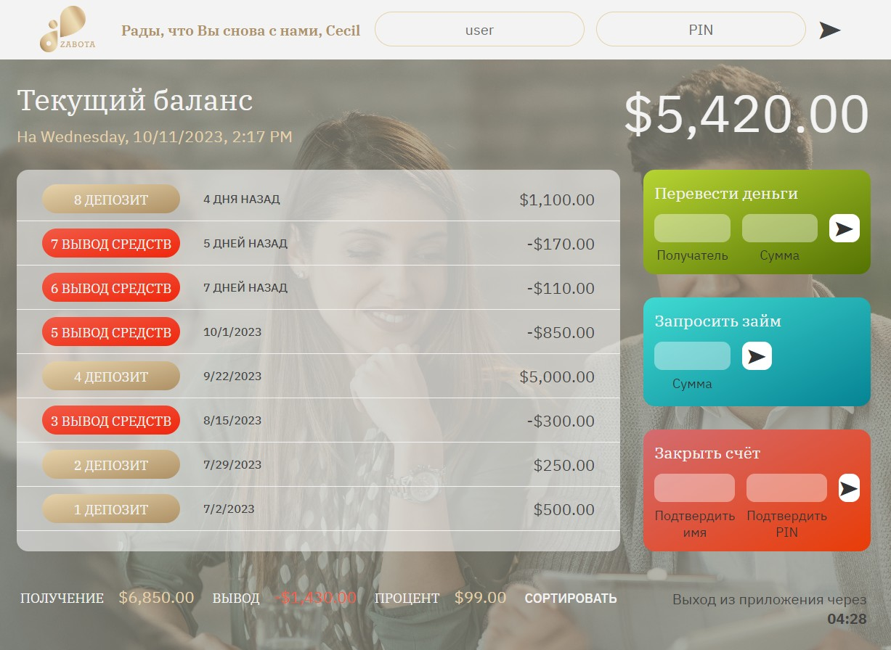

# Личный кабинет банка Забота

Учебный проект курса [***Современный JavaScript - с Нуля до Junior Специалиста***](https://www.udemy.com/course/javascript-zero-to-junior-developer/#instructor-1). Приложение отражает функционал личного кабинета Клиента банка, с возможностью просмотра общего баланса, транзакций, а также перевода средств другому клиенту, запроса займа и закрытия счета. Это проект не предполагает взаимодействия по протоколу HTTP и наличия серверной части. Работа происходит с тестовыми данными.

## **Ключевые навыки:**

- Работа с массивами данных с помощью основных методов массивов
- Создание Элементов DOM
- Работа с числами, датами и таймерами
- Интернационализация Дат
- Интернационализация Чисел

## **Описание проекта**

-  При загрузке страницы приложения отображается страница входа. Есть возможность ввести логин и пароль для получения доступа к аккаунтам. Тестовые данные для входа:

     * user: `ci`, pin: `1111`
     * user: `as`, pin: `2222`
     * user: `cm`, pin: `3333`
     * user: `ks`, pin: `4444`
     * user: `oa`, pin: `5555`

- При входе в аккаунт отображается общий баланс, текущая дата в международном формате с учетом локали клиента, список транзакций с датами, а также суммы поступивших и выведенных средств, полученные проценты.

- Есть возможность переводить средства между клиентами, запрашивать займ и закрыть счет.

- Реализована задержка при добавлении займа.

- Есть сортировка транзакций.

- Присутствует таймер выхода из приложения в случае, если нет активности более 5 минут.

## **Стек технологий**

## [**Демо**](https://alekseeva-t-v.github.io/bank-zabota/)

